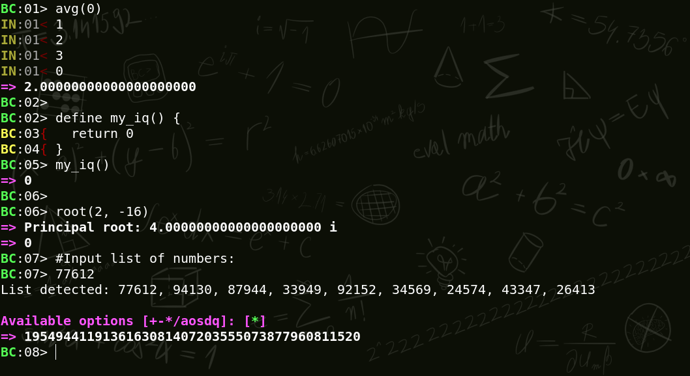

# BC wrapper
<div align="center">

</div>

\
This wrapper turns `bc` into an easier-to-use CLI calculator. One could say it is better, but then that would make it `bbc`... Let's not get ahead of ourselves, so let's stick to `bc` for now.
This wrapper started as a fun project because GNU BC's prompt is non-existent. Having a prompt is crucial, otherwise, how can the user know where to type numbers and funny-looking math symbols as input? Without an interactive prompt, how can the user know when the resulting number shall emerge, abiding by the noble laws of True Mathematics™? These profound inquiries find their resolution within this extraordinary wrapper. But it did not end with the mere addition of a prompt, it escalated by adding multiple functionalities, such as:

- dynamic prompt
- dynamic autocomplete
- manipulation of a list of numbers being pasted into the input
- better control over loops and defining functions
- concurrent input with the option to turn it off
- extra options, like history, numeric base change, Bash access, help for custom library
- library with functions calculating complex numbers

## Installation
The wrapper can contaminate your impeccable system by running:
```bash
git clone https://github.com/Slate5/bc-wrapper.git
cd bc-wrapper
make
```

## Uninstallation
To expunge the wrapper from your system, run the following command from the repository:
```bash
make remove
```

## Desktop application
To use the wrapper as a desktop application, `xfce4-terminal` is required. Install it now to have the most exciting, thrilling and euphoric experience of your life!
###### *(Possible side effects may include headache, diarrhea & constipation, impotence & increased libido, social anxiety & extraversion)

Behold, for true beauty is about to mesmerize you with splendor:




## Usage examples

The command `bc` on a terminal will run this BC wrapper, **overriding GNU's `bc` except for these cases**:

- when executed with flags, e.g. `bc -l`
- when `bc`'s STDIN and/or STDOUT are not opened on a terminal, e.g. `echo 2 + 2 | bc`

### Base option
In a normal `bc` session, if the `ibase` has been set to 2, to switch to the hexadecimal base, it is necessary to type `ibase = 10000` (16 in binary), since `bc` expects input in base 2. The wrapper, unlike the original `bc`, allows changing numeric base using the decimal system, regardless of the current `ibase` (input base):

```c
BC:01> base = 2; 11 * 11
=> 1001
BC:02> base = 16; A + 5
=> F
```

`base` is a custom special variable that changes `ibase` and `obase` (output base) at once.

### Bash access
Bash can be accessed in two ways:

1. by typing `$$`:

```c
BC:01> $$
user@host:~$ echo 2 + 2
2 + 2
user@host:~$ exit
logout
```

2. by typing `$` followed by a Bash command or line of code, in which case Bash's output will be forwarded to the wrapper's input:

```c
BC:01> $ echo 2 + 2
Warning: Bash output goes into BC's input automatically.
=> 4
```

```c
BC:01> ibase = 16
BC:02> $ sha256sum <<< 'I wonder what the checksum in base 10 is' | awk '{ print toupper($1) }'
Warning: Bash output goes into BC's input automatically.
=> 88459510309798899909798798732095866506639491774003091853698086386101035626053
```

### List options
If a list of numbers is pasted into the input, as in:

```
12
213
4
35
5
```

the wrapper will give different options to manipulate the list:

```c
BC:01> 12
List detected: 12, 213, 4, 35, 5

Available options [+-*/aosdq]: [ ]
(a - average, o - output, s - sort, d - descending sort, q - quit)
```


`output` prints the list as output e.g., if the user wants to convert the list of numbers to another numeric base:

```c
BC:01> obase = 2
BC:02> 12
List detected: 12, 213, 4, 35, 5

Available options [+-*/aosdq]: [o]
=> 1100
=> 11010101
=> 100
=> 100011
=> 101
```

### Help functionality
The help functionality `?`, either appended or prepended to one or multiple custom functions, shows the help for those functions, e.g.:
```c
BC:01> isprime(x)?
Help: isprime(x)
      Checks whether the argument is a prime number.

      Returns:
        - 1 when arguments is prime
        - 0 when it is not

BC:02> ? sin() cos()
Help: sin(angle_deg)
      Calculates the sine of an angle.

      The function receives any angle in degrees as argument.

      Returns value.

Help: cos(angle_deg)
      Calculates the cosine of an angle.

      The function receives any angle in degrees as argument.

      Returns value.

```
The custom library can be modified and new functions can be added to it.

